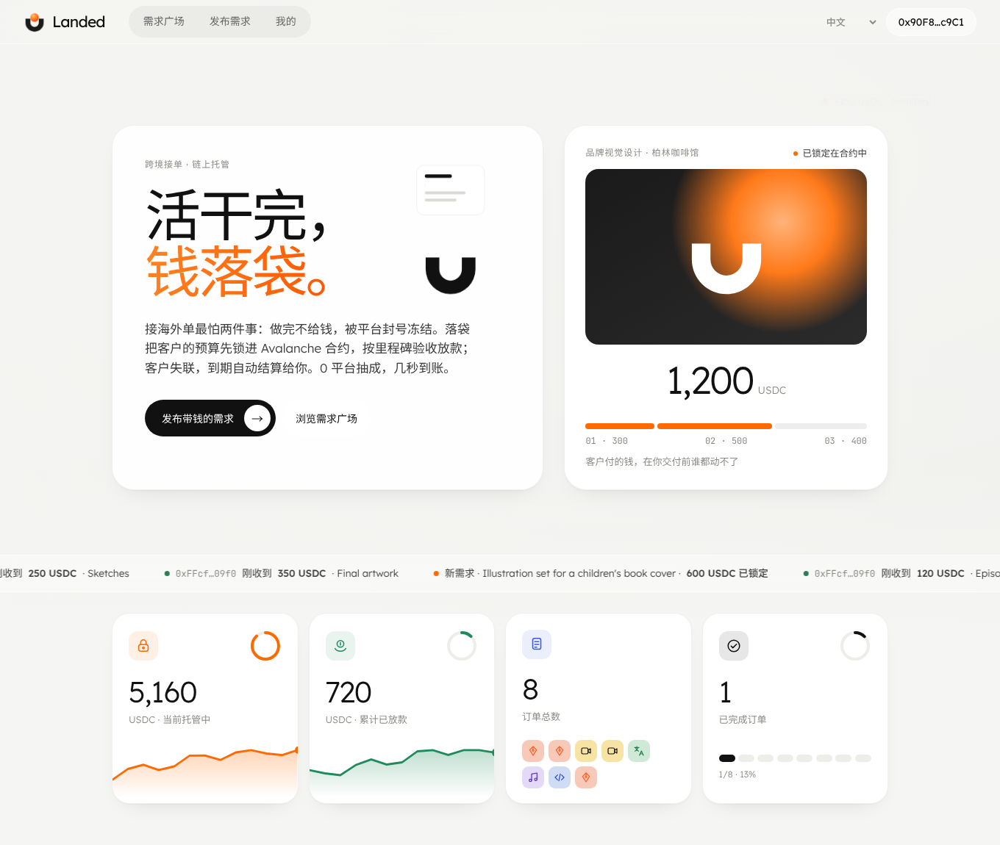
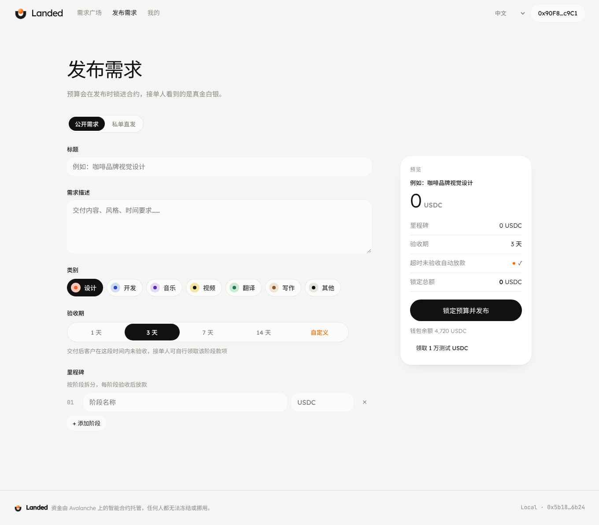
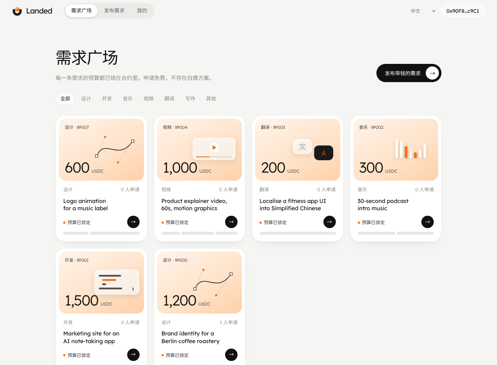
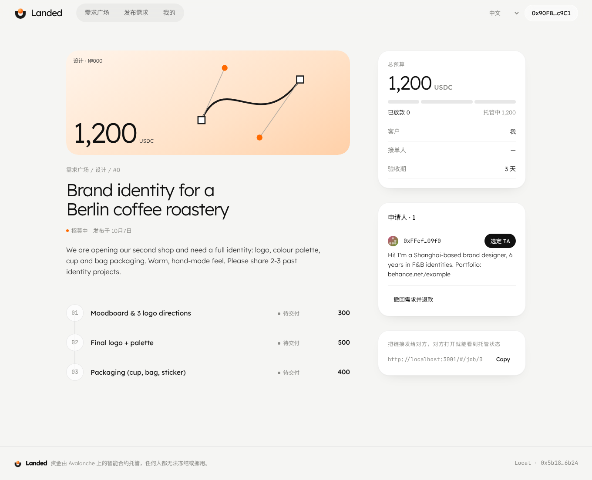
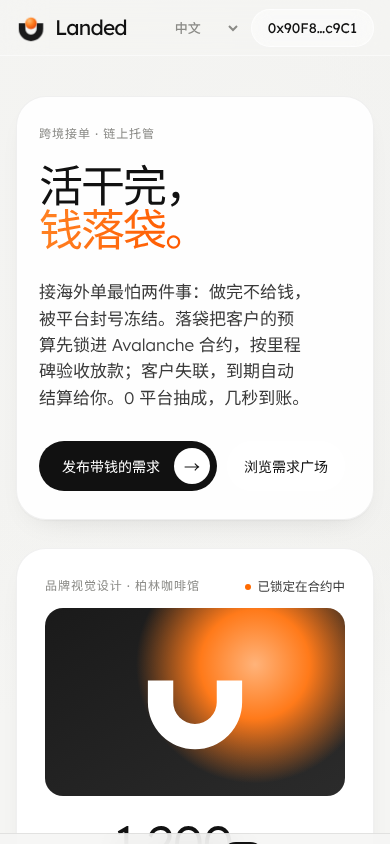

# 落袋 Landed

> 活干完，钱落袋。 / Work done. Money landed.

跨境接单的链上托管：客户发需求时把预算锁进 Avalanche 合约，按里程碑验收放款；客户失联，验收期满接单人自行领取。0 平台抽成，几秒到账，没有人能冻结。

**赛道**：消费应用与支付
**网络**：Avalanche Fuji C-Chain（chainId 43113）
**在线演示 / Live demo**：https://minusplus2025.github.io/landed/
**路演幻灯片 / Slides**：https://claude.ai/artifact/FaMb2vdFPVbALZbfSSwrkg
**合约地址**：Landed `0x05d5A6b00eC5eFcE7bAE65504543c75f3795Dfa8` · TestUSDC `0x1Df84cC053e61AA5AF7B674e79BA2854388378f6`（Fuji）





| 需求广场 | 托管详情 | 手机版 |
|---|---|---|
|  |  |  |

**演示视频**：[docs/demo.mp4](docs/demo.mp4)（首页 → 需求广场 → 托管详情 → 发布需求并锁定预算）

## 要解决的问题

国内有大量设计师、开发者、插画师、编曲、剪辑、译者在接海外单。他们面对的不是"找不到客户"，而是"钱能不能安全到手"：

- **做完不给钱**：私单没有任何保障；客户在另一个国家，起诉不现实。
- **平台封号冻钱**：Upwork 会因 VPN、平台外收款、身份核验等原因封号，被封账户约 80% 无法恢复，余额一起卡住（[来源](https://golance.com/blogs/upwork-account-suspended-what-to-do-next)）。
- **抽成高、放款慢**：Upwork 约 10%～20%，Braintrust 向客户收 15%，托管款常压 1～2 周（[来源](https://www.hireinsouth.com/post/braintrust-pricing)）。
- **客户装死不验收**：钱挂在平台上，只能等客服。
- **假需求、付费投标**：投一次标要买 Connects，有的需求只是为了白嫖方案。
- **信用锁在平台里**：好评换平台就清零。

国内接单有闲鱼担保、法院和数字人民币，但这些都管不到跨境：双方在不同国家，没有一个都信任的机构。这正是链上托管不可替代的地方。

## Live on Avalanche Fuji

| | Address |
|---|---|
| Landed (escrow) | [`0x05d5A6b00eC5eFcE7bAE65504543c75f3795Dfa8`](https://testnet.snowtrace.io/address/0x05d5A6b00eC5eFcE7bAE65504543c75f3795Dfa8) |
| Test USDC | [`0x1Df84cC053e61AA5AF7B674e79BA2854388378f6`](https://testnet.snowtrace.io/address/0x1Df84cC053e61AA5AF7B674e79BA2854388378f6) |

Demo app: https://minusplus2025.github.io/landed/ (switch your wallet to Fuji; use the in-app faucet for test USDC).

## 落袋怎么做

| 现有平台的问题 | 落袋 |
| --- | --- |
| 封号冻钱 | 钱在合约里，没有任何人能封号或冻结，包括我们 |
| 抽成 10%～20% | 0 平台抽成，只付几分钱链上手续费 |
| 放款压 1～2 周 | 客户点验收，几秒到账 |
| 客户失联 | 验收期满，接单人自行领取（`claimAfterTimeout`） |
| 假需求、付费投标 | 每条需求发布时预算已锁定，申请免费 |
| 不许带老客户 | 私单直发：谈好的单生成托管链接发给对方 |
| 信用锁在平台 | 完成单数、收入、争议次数写在链上，永远归你 |

## 功能

- **需求广场**：客户发布"带钱的需求"，整笔预算进入合约托管；创作者免费申请，客户从申请人中选定。
- **私单直发**：已经谈好的单，一步完成锁款和指定接单人，把链接发给对方即可。
- **里程碑托管**：最多 10 个阶段，逐个交付、验收、放款。
- **超时自动结算**：交付后客户在验收期内不回应，接单人可自行领取该阶段款项。验收期由客户发单时自选：1 / 3 / 7 / 14 天，或自定义 1 小时～30 天。
- **争议仲裁**：任一方可发起争议，冻结剩余款项，由中立仲裁人按比例裁决。
- **链上信用主页**：完成订单、累计收入、按时付清率、争议次数，公开可查。
- **多语言**：中文、English、Español、日本語，按浏览器语言自动选择。
- **移动端适配**：客户在手机上打开托管链接也能完成验收。

## 为什么用 Avalanche

- **亚秒级最终性**：验收即到账，体验接近普通支付。
- **低手续费**：每次操作几分钱，小额订单（几十美元）也划算。
- **EVM 兼容 + 稳定币**：用 USDC 计价，避开币价波动；Core / MetaMask 直接可用。
- **扩展路径**：订单量大后可迁到专属 Avalanche L1，自定义 gas 代币，让客户不需要持有 AVAX。

## 技术结构

| 模块 | 文件 | 说明 |
| --- | --- | --- |
| 托管合约 | `contracts/Landed.sol` | 带钱需求、申请、选人、私单直发、里程碑交付/验收、超时领取、争议仲裁、信用记录 |
| 测试稳定币 | `contracts/TestUSDC.sol` | 6 位小数的测试 USDC，带水龙头，仅用于测试网演示 |
| 前端 | `public/` | 无构建步骤的单页应用（ethers.js），所有数据直接读合约，无中心化数据库 |
| 测试 | `test/landed.test.js` | 7 个用例：锁款、完整流程与信用、权限、超时领取、撤回退款、争议裁决、输入校验 |

## 快速开始

```bash
npm install
npm test                         # 合约测试（本地内存链）

cp .env.example .env             # 填入 Fuji 测试网私钥（水龙头: https://core.app/tools/testnet-faucet）
npm run compile
npm run deploy                   # 部署 TestUSDC 和 Landed
npm run seed                     # 可选：灌入演示数据（5 条需求、1 单进行中、1 单已完成）
npm start                        # http://localhost:3000
```

本地链：`npx ganache --chain.chainId 1337 --wallet.deterministic`，然后用 `NETWORK=local` 运行上面的命令。

## 后续计划

- 法币出入金：接入稳定币出入金服务，客户可以用银行卡付款
- 免 gas 体验：账户抽象 + 代付 gas，客户不需要持有 AVAX
- 去中心化仲裁：从单一仲裁人升级为仲裁人池，按信用抽选
- 信用可组合：其他平台可直接读取链上信用，作为接单门槛或费率依据

## License

MIT
