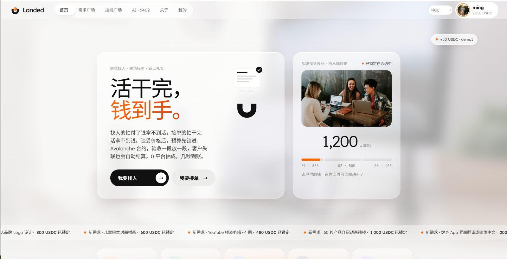
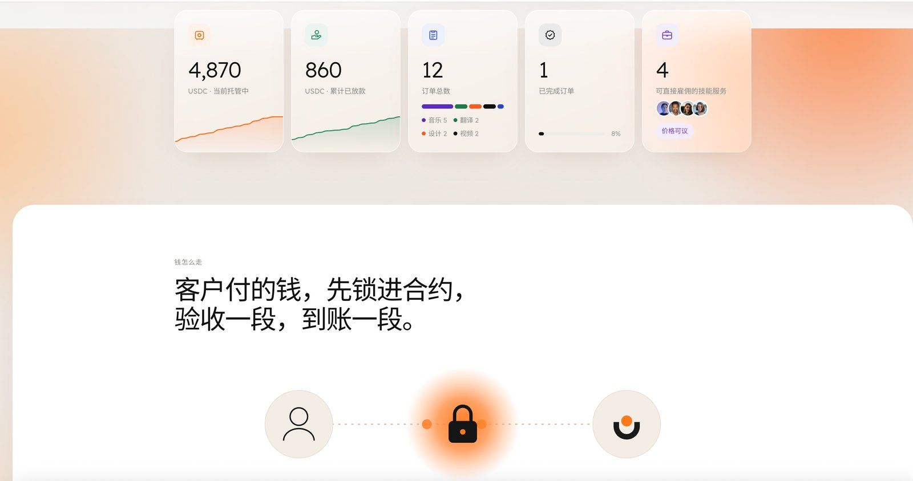
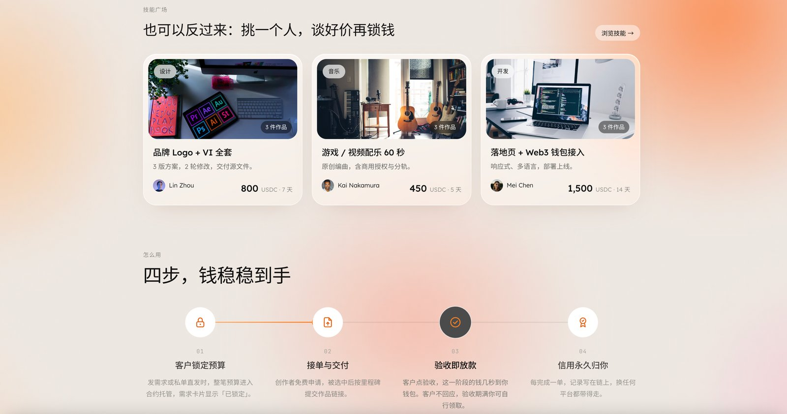
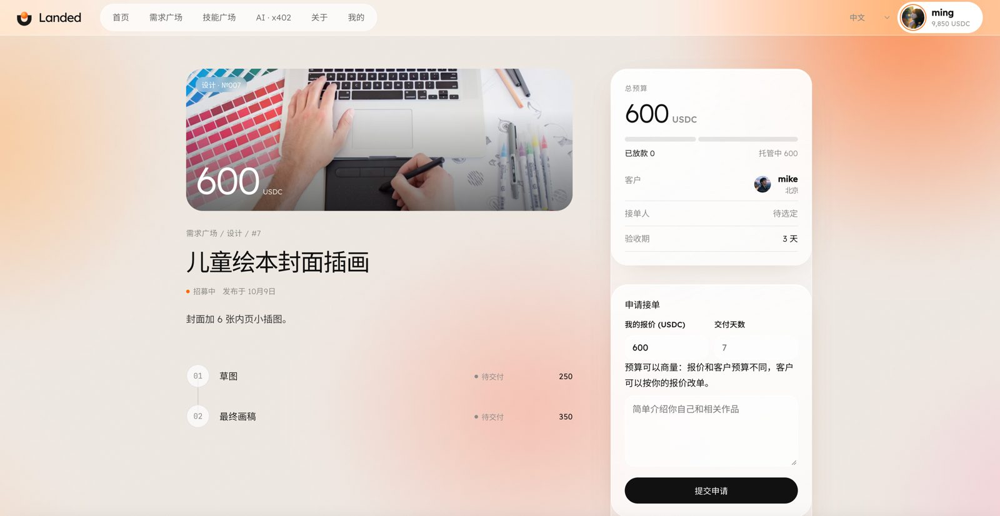
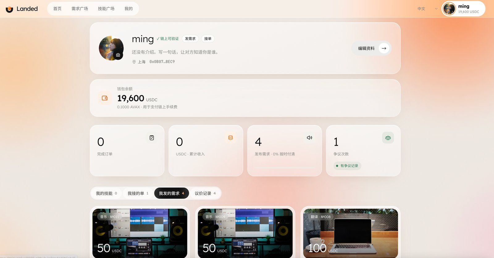
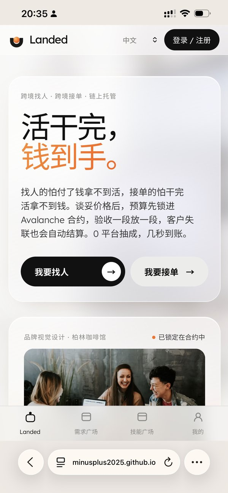
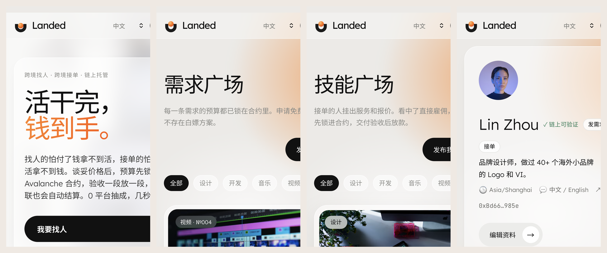

# Landed

> 活干完，钱到手。 / Work done. Money landed.

跨境接单的链上托管：客户发需求时把预算锁进 Avalanche 合约，按里程碑验收放款；客户失联，验收期满接单人自行领取。0 平台抽成，几秒到账，没有人能冻结。

**赛道**：消费应用与支付
**网络**：Avalanche Fuji C-Chain（chainId 43113）
**在线演示 / Live demo**：https://minusplus2025.github.io/landed/
**路演幻灯片 / Slides**：https://claude.ai/artifact/FaMb2vdFPVbALZbfSSwrkg
**合约地址**：Landed `0x05d5A6b00eC5eFcE7bAE65504543c75f3795Dfa8` · TestUSDC `0x1Df84cC053e61AA5AF7B674e79BA2854388378f6`（Fuji）

## 评委体验指南 / How to try it

**只看不操作（无需钱包，30 秒）**：打开在线演示，首页、需求广场、技能广场、需求详情、「我的」示例页都能直接浏览，链上数据实时读取自 Fuji 合约。

**完整走一遍托管流程（约 3 分钟，无需自己找测试币）**：
1. 安装 [Core](https://core.app) 或 MetaMask 浏览器插件，点页面右上角 **登录 / 注册**，连接钱包即完成注册（会自动切到 Avalanche Fuji）。Core 对新域名可能显示安全提醒，这是它对陌生站点的通用提示，可放心点 Connect。
2. **注册即自动到账**：约 0.004 测试 AVAX（手续费）+ 10,000 测试 USDC。余额不足时，个人页会出现「领取测试币」按钮。
3. 「发布需求」：填标题、拆里程碑，点 **锁定预算并发布**，预算即锁进合约。
4. 点右上角头像 → **切换账户**，用第二个钱包地址打开同一需求 **申请接单**（合约禁止自己接自己的单）；再切回第一个地址 **选定 TA**。
5. 接单人 **提交交付**：填作品链接，可拖入成品文件生成 **文件指纹**（SHA-256，文件不上传），链接与指纹一起永久记在链上。
6. 客户 **验收并放款**，USDC 几秒内到账；客户迟迟不验收，验收期满后接单人可自行领取；双方也可 **发起争议**，剩余资金冻结，由仲裁人按比例裁决。点任意文件指纹，可拖入文件核对是否就是当时交付的那一份。所有交易可在 [Snowtrace](https://testnet.snowtrace.io/address/0x05d5A6b00eC5eFcE7bAE65504543c75f3795Dfa8) 查看。

> No faucet needed: connect Core/MetaMask and you automatically receive test AVAX + 10,000 test USDC. Post a job, switch to a second account from the avatar menu and apply, hire, deliver (link + optional SHA-256 file fingerprint recorded on-chain, file never uploaded), approve — funds land in seconds. Disputes freeze the remaining funds for the arbiter.








| 托管详情 | 我的主页 |
|---|---|
|  |  |





**演示视频**：[docs/demo.mp4](docs/demo.mp4)（[在线播放 / 下载](https://github.com/MinusPlus2025/landed/releases/tag/demo)）（发布需求 → 申请接单 → 选定 → 交付带文件指纹 → 验收放款 → 链上核对）

## 要解决的问题

国内有大量设计师、开发者、插画师、编曲、剪辑、译者在接海外单。他们面对的不是"找不到客户"，而是"钱能不能安全到手"：

- **做完不给钱**：私单没有任何保障；客户在另一个国家，起诉不现实。
- **平台封号冻钱**：Upwork 会因 VPN、平台外收款、身份核验等原因封号，被封账户约 80% 无法恢复，余额一起卡住（[来源](https://golance.com/blogs/upwork-account-suspended-what-to-do-next)）。
- **抽成高、放款慢**：Upwork 约 10%～20%，Braintrust 向客户收 15%，托管款常压 1～2 周（[来源](https://www.hireinsouth.com/post/braintrust-pricing)）。
- **客户装死不验收**：钱挂在平台上，只能等客服。
- **假需求、付费投标**：投一次标要买 Connects，有的需求只是为了白嫖方案。
- **信用锁在平台里**：好评换平台就清零。

国内接单有闲鱼担保、法院和数字人民币，但这些都管不到跨境：双方在不同国家，没有一个都信任的机构。这正是链上托管不可替代的地方。

## Live on Avalanche Fuji

| | Address |
|---|---|
| Landed (escrow) | [`0x05d5A6b00eC5eFcE7bAE65504543c75f3795Dfa8`](https://testnet.snowtrace.io/address/0x05d5A6b00eC5eFcE7bAE65504543c75f3795Dfa8) |
| Test USDC | [`0x1Df84cC053e61AA5AF7B674e79BA2854388378f6`](https://testnet.snowtrace.io/address/0x1Df84cC053e61AA5AF7B674e79BA2854388378f6) |

Demo app: https://minusplus2025.github.io/landed/ (switch your wallet to Fuji; use the in-app faucet for test USDC).

## Live on the Landed L1（专属链）

Landed 也部署在自己的 Avalanche L1 上，页面底部可在 **Fuji C-Chain / Landed L1** 之间切换。

| | Value |
|---|---|
| Chain ID | `111230`（gas 代币 LUSD） |
| RPC | `https://nodes-prod.43.207.73.245.sslip.io/ext/bc/2qfQ4qWMPmnUQgKx6zaUupAcmrnAHTeLocH9NsoxfU5oaygT5H/rpc` |
| Landed (escrow) | `0x8F716e4cEc7e336af78b44e738c013e4ff1b908a` |
| Test USDC | `0x493d63523A852836D081E876553C63330E5aB306` |

- **ICM**：L1 已开启 Interchain Messaging，并部署了 ICM 注册表和跨链代币合约（目标：C-Chain 的 USDC 直接进入 L1）。
- **x402**：AI 助手调用 `POST /api/jobs` 时先收到 HTTP 402，签名支付 0.01 USDC（Fuji）后才创建需求，无需账号和 API 密钥。体验页 `#/agent`，接口代码 `x402/worker.js`。
- **关于页**：`#/about`，产品介绍、使用步骤、架构图、更新记录和常见问题。

## Landed 怎么做

| 现有平台的问题 | Landed |
| --- | --- |
| 封号冻钱 | 钱在合约里，没有任何人能封号或冻结，包括我们 |
| 抽成 10%～20% | 0 平台抽成，只付几分钱链上手续费 |
| 放款压 1～2 周 | 客户点验收，几秒到账 |
| 客户失联 | 验收期满，接单人自行领取（`claimAfterTimeout`） |
| 假需求、付费投标 | 每条需求发布时预算已锁定，申请免费 |
| 不许带老客户 | 私单直发：谈好的单生成托管链接发给对方 |
| 信用锁在平台 | 完成单数、收入、争议次数写在链上，永远归你 |

## 功能

平台同时服务两方：**需求方**发带预算的需求、浏览技能直接雇人；**技能方**浏览需求申请接单、挂出自己的技能等客户来谈。

- **需求广场**：客户发布"带钱的需求"，整笔预算进入合约托管；创作者免费申请，客户从申请人中选定。
- **私单直发**：已经谈好的单，一步完成锁款和指定接单人，把链接发给对方即可。
- **技能广场**：接单的人挂出服务、报价和交付天数，生成可分享的技能链接；客户点"雇佣"即生成指定此人的托管单（调用 `postDirect`），预算先锁进合约，验收后放款。技能信息目前存在浏览器本地并编码在链接里，后续计划上链。
- **作品集**：发布技能时可贴图片、视频（YouTube / B站 / mp4）、图文文章和社媒主页链接，自动识别类型并以图集、内嵌视频和链接卡片展示。
- **价格可协商**：申请需求时可附报价和天数，客户可"同意报价，按此价改单"；技能页可发起议价，出价、还价、同意通过链接在双方之间来回，谈妥后客户一键锁定预算。谈妥前不锁钱。
- **里程碑托管**：最多 10 个阶段，逐个交付、验收、放款。
- **超时自动结算**：交付后客户在验收期内不回应，接单人可自行领取该阶段款项。验收期由客户发单时自选：1 / 3 / 7 / 14 天，或自定义 1 小时～30 天。
- **争议仲裁**：任一方可发起争议，冻结剩余款项，由中立仲裁人按比例裁决。
- **链上信用主页**：完成订单、累计收入、按时付清率、争议次数，公开可查。
- **个人页管理**：同时照顾发需求和接单两种身份。可编辑昵称、头像、介绍、作品集、时区和语言；分标签查看"我发的需求 / 我接的单 / 我的技能 / 议价记录"，可下架自己的技能。
- **登录 / 注册**：弹窗选择 Core 或 MetaMask，钱包地址即账号；首次连接自动注册并引导填写资料；未安装钱包时给出下载入口和三步指引。
- **多语言**：中文、English、Español、日本語，按浏览器语言自动选择。
- **移动端适配**：客户在手机上打开托管链接也能完成验收。
- **磨砂玻璃界面**：半透明毛玻璃卡片、柔和橙色光斑背景、胶囊输入框。

## 为什么用 Avalanche

- **亚秒级最终性**：验收即到账，体验接近普通支付。
- **低手续费**：每次操作几分钱，小额订单（几十美元）也划算。
- **EVM 兼容 + 稳定币**：用 USDC 计价，避开币价波动；Core / MetaMask 直接可用。
- **专属 L1（已上线）**：Landed L1 用自己的 gas 代币 LUSD，将来可由平台代付手续费，让用户不需要持有 AVAX。
- **ICM**：两条链之间通过 Avalanche 跨链消息互通。
- **x402**：AI 助手按次付费调用接口，用 USDC 结算。

## 技术结构

| 模块 | 文件 | 说明 |
| --- | --- | --- |
| 托管合约 | `contracts/Landed.sol` | 带钱需求、申请、选人、私单直发、里程碑交付/验收、超时领取、争议仲裁、信用记录 |
| 测试稳定币 | `contracts/TestUSDC.sol` | 6 位小数的测试 USDC，带水龙头，仅用于测试网演示 |
| 前端 | `public/` | 无构建步骤的单页应用（ethers.js），所有数据直接读合约，无中心化数据库 |
| x402 接口 | `x402/worker.js` | Cloudflare Worker：返回 402、调用结算服务验证并上链 |
| L1 部署页 | `public/deploy-l1.html`、`public/seed-l1.html` | 在浏览器里用钱包把合约部署到 L1，并发布示例需求 |
| 测试 | `test/landed.test.js` | 7 个用例：锁款、完整流程与信用、权限、超时领取、撤回退款、争议裁决、输入校验 |

## 快速开始

```bash
npm install
npm test                         # 合约测试（本地内存链）

cp .env.example .env             # 填入 Fuji 测试网私钥（水龙头: https://core.app/tools/testnet-faucet）
npm run compile
npm run deploy                   # 部署 TestUSDC 和 Landed
npm run seed                     # 可选：灌入演示数据（5 条需求、1 单进行中、1 单已完成）
npm start                        # http://localhost:3000
```

本地链：`npx ganache --chain.chainId 1337 --wallet.deterministic`，然后用 `NETWORK=local` 运行上面的命令。

## 后续计划

- 法币出入金：接入稳定币出入金服务，客户可以用银行卡付款
- 免 gas 体验：账户抽象 + 代付 gas，客户不需要持有 AVAX
- 去中心化仲裁：从单一仲裁人升级为仲裁人池，按信用抽选
- 信用可组合：其他平台可直接读取链上信用，作为接单门槛或费率依据

## License

MIT
